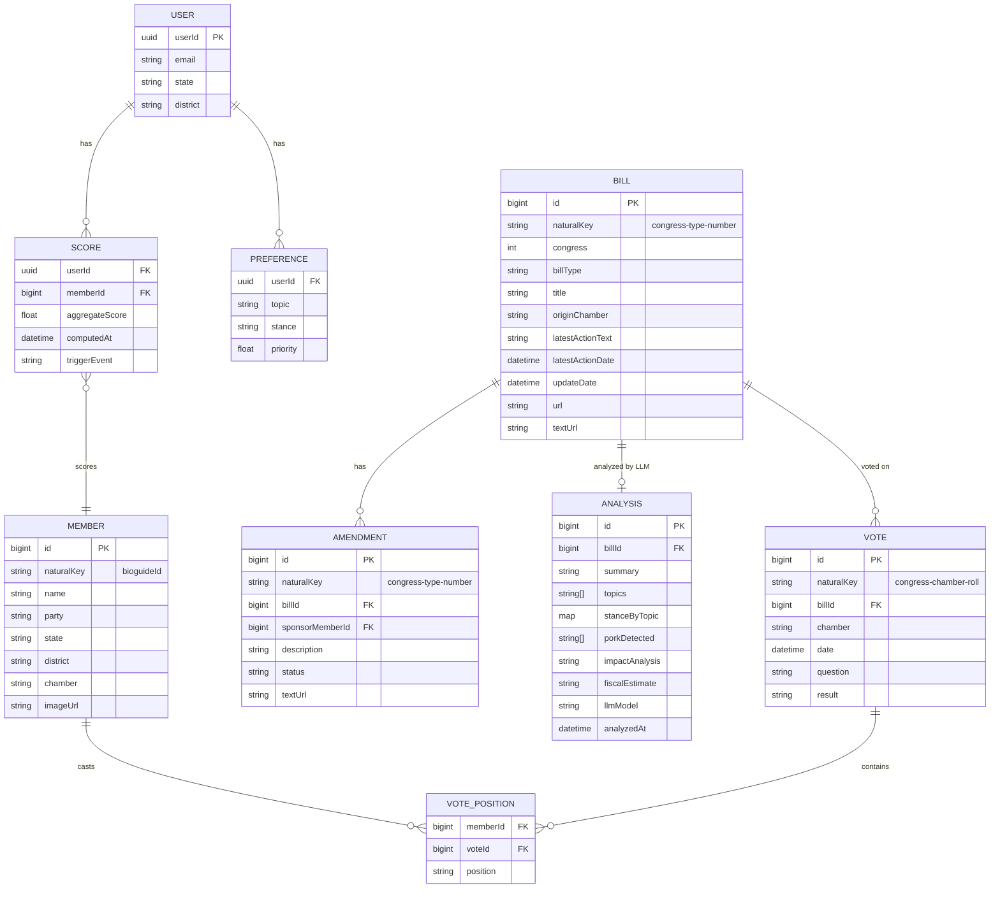

> Part of [System Design](../SYSTEM_DESIGN.md)

## Data Model Overview

```mermaid
erDiagram
    BILL ||--o{ VOTE : "voted on"
    BILL ||--o{ AMENDMENT : "has"
    BILL ||--o| ANALYSIS : "analyzed by LLM"
    MEMBER ||--o{ VOTE_POSITION : "casts"
    VOTE ||--o{ VOTE_POSITION : "contains"
    USER ||--o{ PREFERENCE : "has"
    USER ||--o{ SCORE : "has"
    SCORE }o--|| MEMBER : "scores"

    BILL {
        bigint id PK
        string naturalKey "congress-type-number"
        int congress
        string billType
        string title
        string originChamber
        string latestActionText
        datetime latestActionDate
        datetime updateDate
        string url
        string textUrl
    }

    MEMBER {
        bigint id PK
        string naturalKey "bioguideId"
        string name
        string party
        string state
        string district
        string chamber
        string imageUrl
    }

    VOTE {
        bigint id PK
        string naturalKey "congress-chamber-roll"
        bigint billId FK
        string chamber
        datetime date
        string question
        string result
    }

    VOTE_POSITION {
        bigint memberId FK
        bigint voteId FK
        string position
    }

    AMENDMENT {
        bigint id PK
        string naturalKey "congress-type-number"
        bigint billId FK
        bigint sponsorMemberId FK
        string description
        string status
        string textUrl
    }

    ANALYSIS {
        bigint id PK
        bigint billId FK
        string summary
        string[] topics
        map stanceByTopic
        string[] porkDetected
        string impactAnalysis
        string fiscalEstimate
        string llmModel
        datetime analyzedAt
    }

    USER {
        uuid userId PK
        string email
        string state
        string district
    }

    PREFERENCE {
        uuid userId FK
        string topic
        string stance
        float priority
    }

    SCORE {
        uuid userId FK
        bigint memberId FK
        float aggregateScore
        datetime computedAt
        string triggerEvent
    }
```
